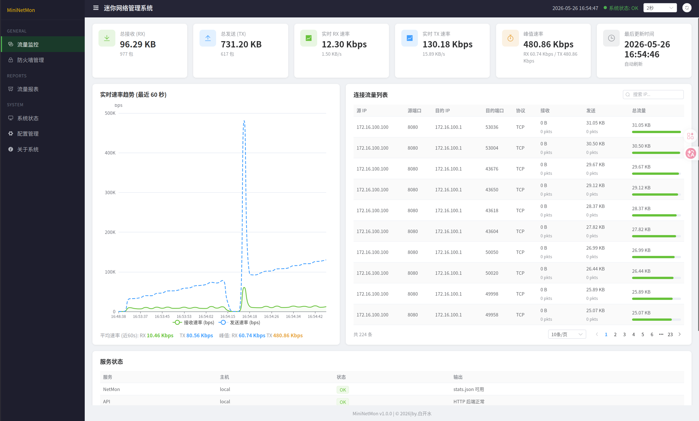

# 基于 OpenWrt 的迷你网络管理系统

这是一个运行在 OpenWrt 平台上的轻量级网络管理系统，提供 Web 可视化界面，实现网络流量监控与防火墙管理等功能。


## 功能特性

### 流量监控
支持实时监测网络流量信息，包括：

- 源 IP 地址 / 目的 IP 地址
- 累计发送流量与接收流量
- 实时流量速率
- 流量峰值统计
- 指定时间窗口内的平均流量

### 防火墙管理
支持通过 Web 页面进行防火墙配置与管理，包括：

- 查看当前防火墙规则状态
- 新增防火墙规则
- 删除防火墙规则
- 清空防火墙规则
- 防火墙规则生效验证

## 技术栈

- **平台**：OpenWrt（交叉编译）
- **流量采集**：C、libpcap
- **后端 API**：Python 3
- **防火墙**：iptables（Shell / Python 脚本）
- **前端**：JavaScript、CSS、Vue 3、Vite、Element Plus、ECharts
- **构建**：CMake

## 项目结构
``` bash
.
├── project1
│   │
│   ├── CMakeLists.txt
│   │
│   ├── include  // 对外接口定义
│   │   ├── capture.h
│   │   ├── config.h
│   │   ├── history.h
│   │   ├── iface_info.h
│   │   ├── logger.h
│   │   └── packet_handler.h
│   │
│   ├── src
│   │   ├── capture.c // 捕获模块
│   │   ├── config.c // 配置文件
│   │   ├── history.c  // 历史记录模块
│   │   ├── iface_info.c  // 地址信息获取模块
│   │   ├── logger.c // 自定义日志
│   │   ├── main.c  // 入口
│   │   └── packet_handler.c  // 包处理模块
│   │
│   └── tests // 模块测试
│   
├── web
│   ├── scripts //防火墙管理脚本
│   ├── ui  //前端
│   └──server.py //api
│   
├── README.md
│   
└── toolchain.cmake
```

## 项目依赖
本项目采用ubuntu与openwrt交叉编译的开发方式。开发与编译在 Ubuntu 上进行，目标程序在 OpenWrt 设备上运行。依赖分为开发机与路由器两类。

### Host（Ubuntu）

- cmake
- gcc
- nodejs
- npm
- python3
- OpenWrt SDK

### OpenWrt Runtime

- python3/python3-light
- libpcap
- iptables
- iptables-mod-extra


## 项目构建

### 抓包模块编译
``` bash
cd project1
mkdir -p build && cd build  #可以省略，但建议加上（因为make后会生成大量文件）。
cmake .. -DCMAKE_TOOLCHAIN_FILE=../../toolchain.cmake
make netmon
```
- 编译完成后生成：project1/build/netmon

### 前端模块构建
``` bash
cd web/ui
VITE_API_BASE=http://{OpenWrt IP}:8080 npm run build
```
- 说明：8080 为 server.py API 端口，若需修改请先更改server.py中的端口
- 构建完成后生成：web/ui/dist/


## 项目部署

### 创建目录
``` bash
mkdir -p /www/netmon
mkdir -p /opt/netmon
mkdir -p /tmp/netmon
```
### 上传文件至OpenWrt
- 上传web/ui/dist/*至/www/netmon/
上传后的文件结构应为：
``` bash
/www/netmon/
    ├── index.html
    └── assets/
```
- 上传web/server.py至/opt/netmon/
- 上传web/scripts至/opt/netmon/
- 上传project1/build/netmon至/usr/sbin/

### 设置权限
``` bash
chmod +x /usr/sbin/netmon
chmod +x /opt/netmon/scripts/*.sh
```

### 启动服务
- 启动流量采集
``` bash
netmon -i {网卡类型} &
```
正常启动后应存在：/tmp/netmon/stats.json

- 启动api服务
``` bash
cd /opt/netmon
python3 server.py &
```

### 测试服务
- 测试健康接口
``` bash
wget -qO- http://127.0.0.1:8080/api/health
```
- 测试流量接口(能返回json即为正常)
``` bash
wget -qO- http://127.0.0.1:8080/api/traffic
```

### 设置开机自启动
``` bash
vi /etc/rc.local
``` 
在
``` bash
exit 0
```
前添加：
``` bash
mkdir -p /tmp/netmon

/usr/sbin/netmon -i br-lan &

cd /opt/netmon
python3 server.py &
```

## 访问web页面
浏览器访问
``` bash
http://{OpenWrt IP}/netmon/
```
或者
``` bash
http://{OpenWrt IP}/netmon/#/traffic
```

## Author
白开水


